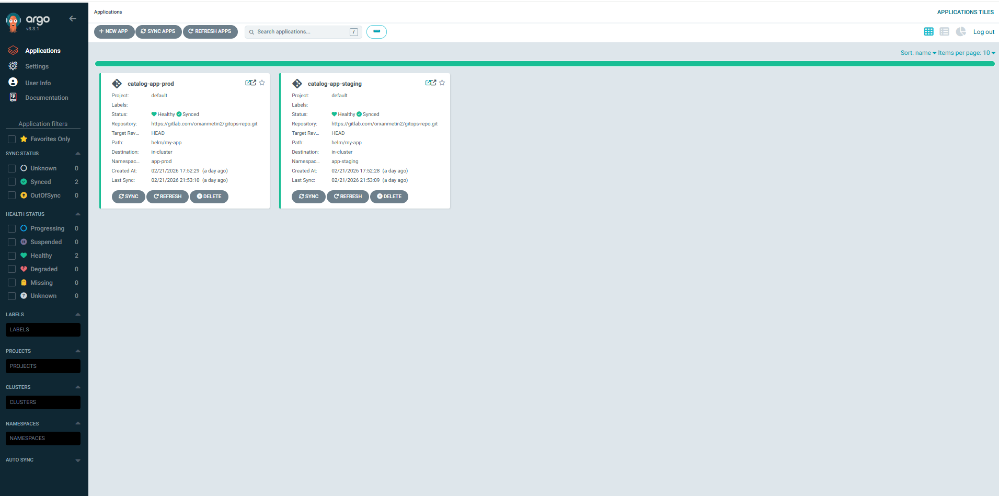
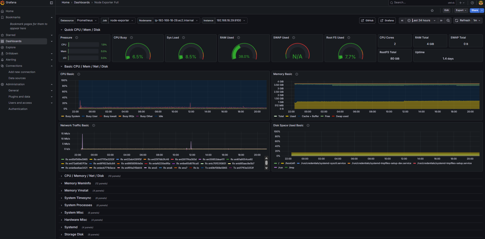
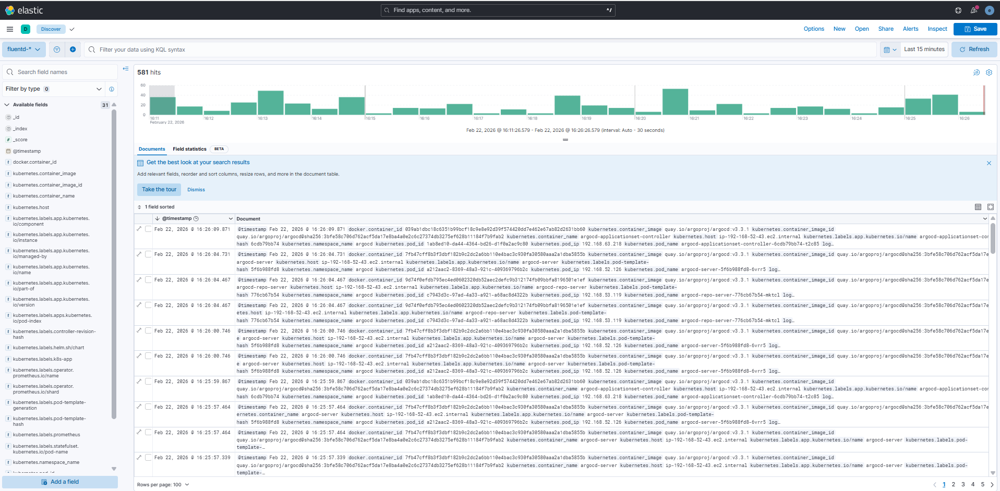

# E-Commerce Product Catalog Microservice

Production-ready microservice platform deployed on AWS EKS.

## Tech Stack
| Category | Technology |
|----------|-----------|
| Runtime | Node.js + Express |
| Database | AWS RDS PostgreSQL |
| Cache | AWS ElastiCache Redis |
| Container | Docker |
| Orchestration | Kubernetes (EKS) |
| GitOps | ArgoCD |
| CI/CD | GitLab CI |
| Monitoring | Prometheus + Grafana |
| Logging | EFK Stack |
| Ingress | NGINX + NLB |

## API Endpoints
| Method | Endpoint | Description |
|--------|----------|-------------|
| GET | /health | Health check |
| GET | /api/products | List all (Redis cached) |
| POST | /api/products | Create product |
| PUT | /api/products/:id | Update product |
| DELETE | /api/products/:id | Delete product |

## Screenshots

### ArgoCD - GitOps Deployment

### Grafana - Monitoring Dashboard

### Kibana - Centralized Logging

